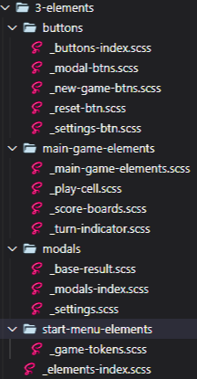

<style>
  h1 {
    font-weight : bold;
  }

  .fm-link {
    color: #f2b137;
    font-weight: bold;
    text-decoration: underline;
  }

</style>


<h1><span style="color: #31C3BD;">Frontend Mentor</span> - <span style="color: #F2b137">Tic</span> <span style="color: #31c3bd">Tac</span> <span style="color: #F2b137">Toe</span></h1> 

<p>
This is my solution to the <a class="fm-link" href="https://www.frontendmentor.io/challenges/tic-tac-toe-game-Re7ZF_E2v">Tic Tac Toe challenge on Frontend Mentor</a>. Frontend Mentor challenges help you improve your coding skills by building realistic projects. 
</p>

<p>Check out the project here:<p>

- Solution URL: [Github Repo](https://github.com/JoshDagat/FM-tic-tac-toe)
- Live Site URL: [Live Site](https://joshdagat.github.io/FM-tic-tac-toe/)

</br>
<hr>

<h2 class="contents__header">Table of Contents:</h2>
  <ul class='contents'>
    <li>Overview
      <ul>
        <li><a href="#challenge">The Challenge</a></li>
        <li><a href="#screenshots">Screenshots</a></li>
      </ul>
    </li>
    <li>My Process
      <ul>
        <li><a href="">HTML</a></li>
        <li><a href="">CSS</a></li>
        <li><a href="">Javascript</a></li>
      </ul>
    </li>
    <li><a>Built With</a></li>
    <li><a>What I learned</a></li>
    <li><a>Continued development</a></li>
    <li><a>Author</a></li>
    <li><a>Acknowledgments</a></li>
  </ul>
<hr>
<h2 id="overview">Overview</h2>

<p id="challenge">The challenge is to build out a Tic Tac Toe game and get it looking as close to the design as possible.</p>


<span>Users should be able to:</span>

- [x] View the optimal layout for the game depending on their device's screen size
- [x] See hover states for all interactive elements on the page
- [x] Play the game either solo vs the computer or multiplayer against another person
- [x] **Bonus 1**: Save the game state in the browser so that it’s preserved if the player refreshes their browser
- [x] **Bonus 2**: Instead of having the computer randomly make their moves, try making it clever so it’s proactive in blocking your moves and trying to win

<hr>
<h2 id="screenshots">Screenshots</h2>

### iPhone 6/6S (375 x 667)


### Samsung Galaxy Note 5 (480 x 853)


### iPad Mini 2 & 3 (768 x 1024)


### Desktop 19" (1440 x 900)


<hr>
<h2>My Process</h2>

<h3>HTML</h3>

<p>I started out wih fleshing out the HTML and CSS. At first I structired each cell this way: 
</p>

```html
  <div id="a1" class="main-game__play-cell" data-turn-flag="1" data-value="">

    <div class="cross">
      <svg>//Cross svg//</svg>
    </div>

    <div class="circle">
      <svg>//Cross svg//</svg>
    </div>

    <div class="cross--outline">
      <svg>//Cross svg//</svg>
    </div>

    <div class="circle--outline">
      <svg>//Cross svg//</svg>
    </div>
  </div>

```
<p>Inside each cell I had 4 embedded svgs and would add '.active' to whichever svg was needed. I had two data attributes 'turn-flag' and 'value' which I used to trigger which svg to show.'Data-turn-flag=1' would trigger cross while 'Data-turn-flag=2' would trigger circle. 'Data-value' kept track of who owned the cell.</p>

<p>Eventually though I dropped this structure. I realized it was overcomplicated and there was a better way of doing things. I settled with the following structure after:</p>

```html
  <div id="cell-0" class="cell">
    <div class="cell__svg">
      <svg>
        <use class="cell__svg-link" href=""></use>
      </svg>
    </div>
  </div>

  /* Further down the document */

  <svg style="display: none">
      <symbol id="cross--win">
        // Cross svg
      </symbol>
  </svg>

```
<p>I simplified the cell structure and used a linked svg structure. This way, the HTML file didn't get bloated with similar svg. Using the 'href' attribute I could use whichever svg was needed.</p>
<h3>CSS</h3>

<p>For this project I decided to use SCSS. I wanted to build my skill with using CSS preprocessors. I decided to go with my own file structure. </p>

<p>The first folder contains variables and mixins. Snippets of code that are reusable.</p>
<br>

<br><br>
<p>The second folder contains css reset and those css that broadly affects the document.  </p>
<br>

<p>The 3rd folder contains css for containers. This are the block level divs that contain smaller elements.<p>

<p>The 4th and final folder contains CSS for al elements:</p>


<h3>Javascript</h3>

<p>For this project I went ahead and used vanilla Javascript. This is my first time going for a modular approach with Javascript. I also went for an OOP approach where methods that, in my opinion, are closely related are found in a single object.</p>

<p>When I first started, I managed to simulate a simple "AI" to take a turn after the player did. It would choose a random cell from an array of empty(unmarked) cells.</p>

<p>However, this approach was lacking since the "AI" didn't take into consideration whether or not the enemy or the AI was winning. To remedy this, I studied about the<a href="https://www.youtube.com/watch?v=KU9Ch59-4vw">Minimax</a> algorithm.</p>

<p>From there I came upon this <a href="https://www.youtube.com/watch?v=P2TcQ3h0ipQ&t=1340s">FreeCodeCamp Video on Tic Tac Toe using minimax</a>.</p>

<h2>Built With</h2>


<h2>What I Learned</h2>

- I learned how to use embedded SVGs and use them as an href link.
- I learned how minimax works.
- I learned about the SVG viewbox and how to manipulate it.
- I learned about modular javascript.
- I implemented my first OOP approach to a project.
- I learned about sessionStorage, localStorage and cookies.

<h2>Continued Development</h2>

<p>At the moment my program works using minimax, however, it doesn't use <a href="https://www.youtube.com/watch?v=xBXHtz4Gbdo">alpha-beta pruning</a>. This means it keeps runnning through scenarios which would and should never occur.</p>

<p>In the future, I plan to study alpha-beta pruning and apply it on this project.</p>

<h2>Useful resources</h2>

- [FreeCodeCamp (FCC)](https://www.freecodecamp.org/news/how-to-make-your-tic-tac-toe-game-unbeatable-by-using-the-minimax-algorithm-9d690bad4b37) - This article helped me wrap my head around minimax.
- [FCC Tic Tac Toe](https://www.youtube.com/watch?v=P2TcQ3h0ipQ&t=1340s) - This video showed me how minimax works with tic tac toe.
- [Frontend Mentor](https://www.frontendmentor.io/) - Contains challenges for getting better at development.

<h2>Author</h2>

-   LinkedIn - [Josuer Bague](https://www.linkedin.com/in/josuer-bague/)
-   Frontend Mentor - [Josuer Bague](https://www.frontendmentor.io/profile/JoshDagat)
-   Github - [JoshDagat](https://github.com/JoshDagat)
-   CodeWars - [JosuerB](https://www.codewars.com/users/JosuerB)

<h2>Acknowledgments</h2>

<p>Much thanks to <a href="https://www.freecodecamp.org/">FreeCodeCamp</a> for their never-ending mission to teach coding.</p>

<p>Thanks to <a href="https://www.freecodecamp.org/">MixKit</a> for their free audio snippets.</p>

<p>A big thanks to <a href="https://www.youtube.com/kepowob">Kevin Powell</a> and his <a href="https://discord.gg/jbuT9pAc">Discord group</a>. His community has been a great help.</p>
